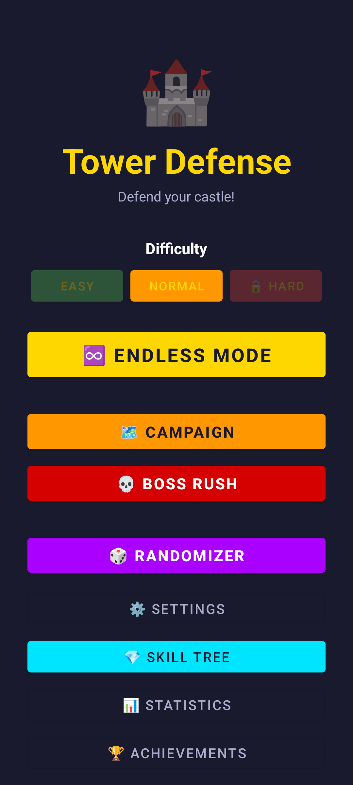
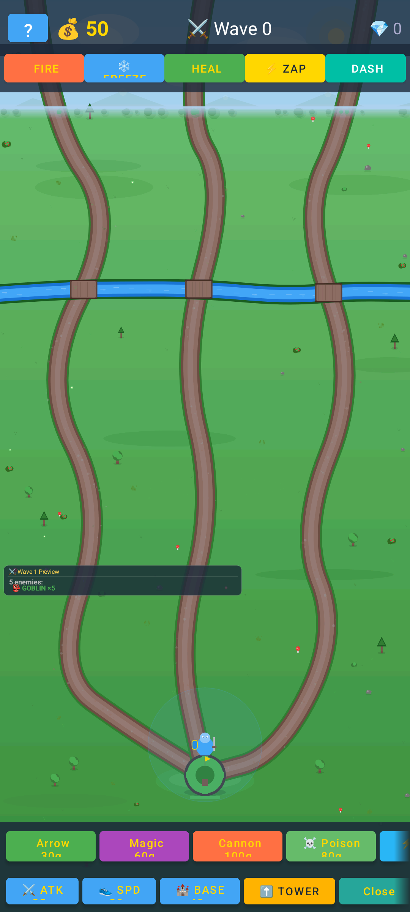
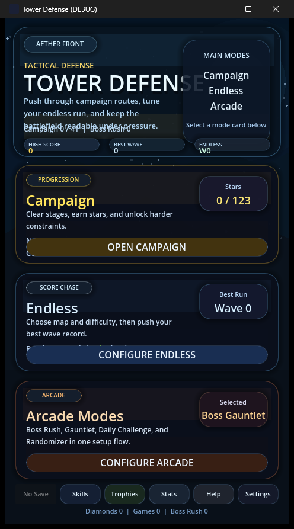
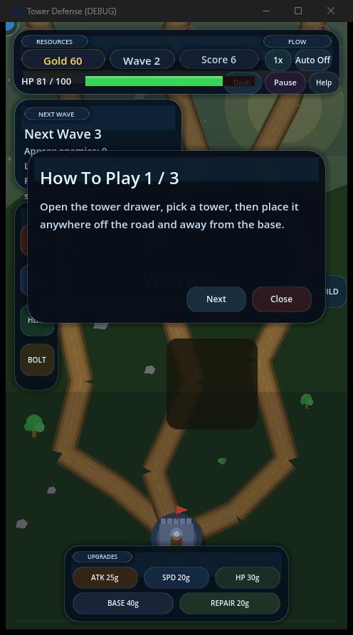
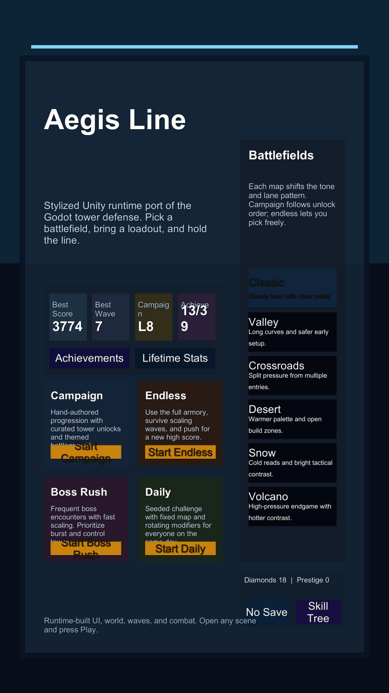
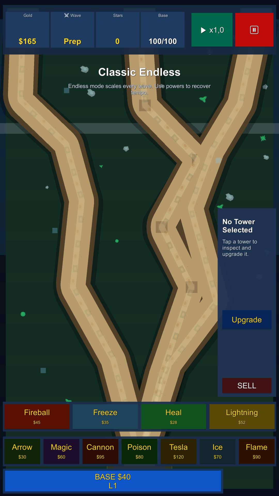

# Tower Defense Case Study

One gameplay concept rebuilt in three different environments:

- **Kotlin / Android** - native mobile version, custom rendering with Android Canvas.
- **Godot / GDScript** - engine-based version focused on scenes, signals, UI flow, audio, and fast iteration.
- **Unity / C#** - code-first port focused on runtime setup, reusable data, and C# architecture.

This repository is the portfolio case study that connects the three implementations. The goal was not just to make a game, but to compare how the same systems behave across different stacks and to show that I can move logic between technologies without losing the core product idea.

## What The Case Study Shows

- Translating the same domain model into Kotlin, GDScript, and C#.
- Building wave, tower, enemy, projectile, campaign, upgrade, achievement, and save systems.
- Comparing native Android rendering against engine-based workflows.
- Keeping gameplay rules and balancing data aligned across implementations.
- Learning where each stack is strongest: raw control, rapid scene/UI iteration, or structured C# tooling.

## Version Comparison

| Version | Stack | Main Purpose | Strongest Signal |
| --- | --- | --- | --- |
| Android | Kotlin, Android Canvas, SharedPreferences | Original implementation and gameplay reference | Custom rendering, mobile UI, persistence, game loop without a dedicated engine |
| Godot | Godot 4, GDScript, scenes, signals, autoloads | Engine research and faster gameplay iteration | Scene composition, HUD flow, wave preview, audio, save manager |
| Unity | Unity 6, C# | Code-first engine port | Runtime setup, C# systems, shared campaign data, editor/gameplay workflow |

## Shared Feature Set

- 20-level campaign structure.
- Multiple tower types with upgrades and different combat roles.
- Enemy waves, boss encounters, and difficulty modifiers.
- Player powers, economy, scoring, and progression.
- Save/continue flow, achievements, and stats screens.
- UI adapted separately for each environment.

## Repositories

- Android/Kotlin: <https://github.com/rogal01/tower-defense-android>
- Godot/GDScript: <https://github.com/rogal01/tower-defense-godot>
- Unity/C#: <https://github.com/rogal01/tower-defense-unity-port>

## Screenshots

### Android / Kotlin

### Godot / GDScript

### Unity / C#

## What I Learned

The Android version gave me the most control because every draw call, input path, and persistence decision is explicit. Godot was faster for scene composition, UI, and iteration. Unity gave the best C# structure and editor tooling, but required cleanup around project files and generated folders.

The useful portfolio story is that I can build a system once, understand its rules, and then re-implement it in a different stack while preserving the product behavior.

## Current Polish Checklist

- Keep Unity generated folders such as `Library`, `Temp`, and `Logs` out of Git.
- Add short clips or GIFs for gameplay if Useme allows media.
- Make sure each linked repository has a clean README, no private data, and a clear run guide.
